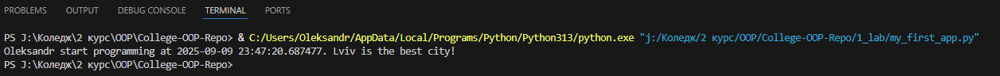
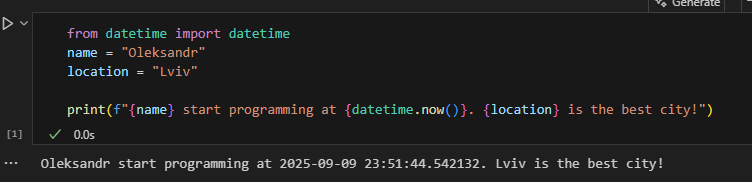
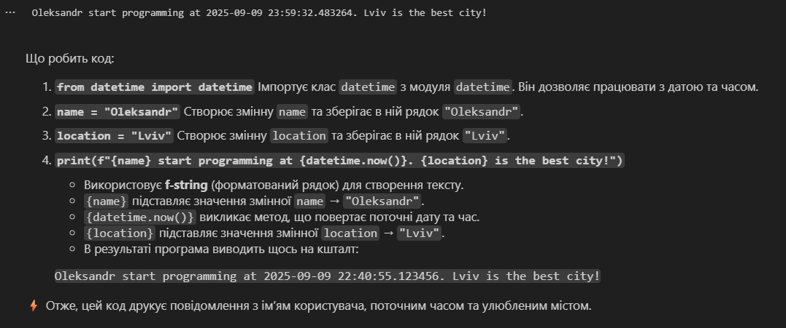

# Звіт до роботи
## Тема: _Оформлення робіт та перша програма_
### Мета роботи: _Оформлення робіт та перша програма_

---
### Виконання роботи
* Результати виконання завдання;
    1. Встановити додаткові плагіни `Python` та `Jupyter`.
    1. Створили новий файл `my_first_app.py` та скопіювали в нього код програми.
        ```python
        from datetime import datetime
        name = "Bohdan"
        location = "Lviv"

        print(f"{name} start programming at {datetime.now()}. {location} is the best city!")
        ```
    1. Змінили значення змінної `name` на своє імя, замінили змінну `location` на своє улюблене місто та натиснули на кнопку `Run Python File` щоб запустити програму;
    1. Термінал вивів: 
    1. Створили новий файл `my_first_app.ipynb`.
    1. Скопіювали минулий код у першу комірку, натиснули кнопку `Run All`.
    1. Вивід програми: 
    1. Створили ще одну комірку з типом `Markdown`. Написалм опис коду.
    1. Натиснули `Run All`.
    1. Вивід програми: 
    1. Запитали у ChatGPT яку б першу програму написав АІ та чи б міг АІ пояснити її. Ось результат:

## 🖥️ Код програми

```python
from datetime import datetime

print("👋 Hello, world!")
print(f"🤖 I am an AI, and today is {datetime.now():%d.%m.%Y %H:%M}")
```

---

## 📖 Пояснення крок за кроком

1. **`from datetime import datetime`**
   Ми підключаємо модуль `datetime`, щоб отримати поточну дату та час.

2. **`print("👋 Hello, world!")`**
   Це класична перша програма, яка виводить привітання у консоль.
   Тут я додаю емодзі, щоб зробити її більш "теплою".

3. **`print(f"🤖 I am an AI, and today is {datetime.now():%d.%m.%Y %H:%M}")`**

   * Використовується **f-string** для форматованого рядка.
   * `{datetime.now():%d.%m.%Y %H:%M}` виведе дату у форматі `день.місяць.рік години:хвилини`.
   * Програма друкує повідомлення від імені ШІ з актуальним часом.

---

## 📌 Приклад виводу

```
👋 Hello, world!
🤖 I am an AI, and today is 09.09.2025 22:50
```

---
### Висновок:
> У ході виконання даної роботи ми навчилися:
- Писати елементарні програми на мові програмування `Python`
- Створювати та редагувати файли розширення `.py` та `.ipynb`
- Оформлювати звіт у вигляді `Markdown` файла
- Генерувати елементарні програми за допомогою ШІ `ChatGPT`
---