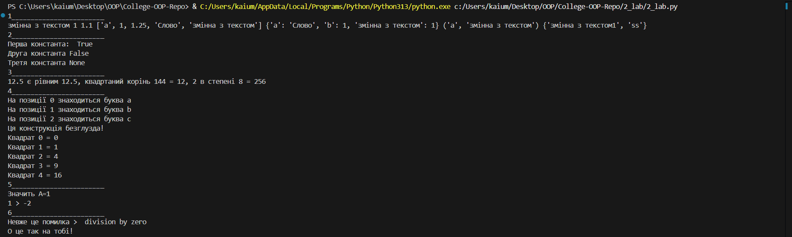
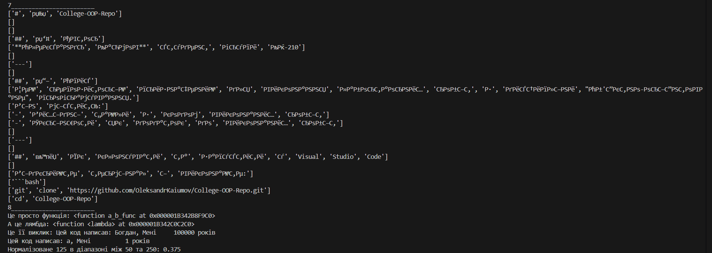
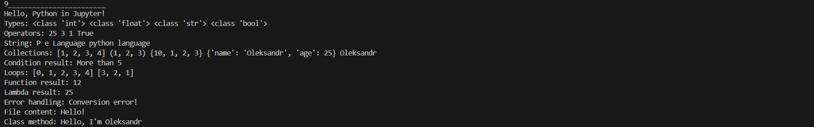

# Звіт до роботи
## Тема: _Основи програмування на Python_
### Мета роботи: _Навчитись застосовувати основні конструкції мови Python, виконати всі приклади та з використанням AI створити власні приклади які демонструють особливості кодових конструкцій Python_

---
### Виконання роботи
* Результати виконання завдання;
   1. Познайомтесь з основними типами даних. Попракитикуйтесь з простими змінними str та int, списками list, наборами set та словниками dict:
      ```python
      a = "змінна з текстом"
      b = 1 # числова Змінна
      b1 = 1.1 
      c = ["a", 1, 1.25, "Слово", a] # List
      d = {"a": "Слово", "b": 1, a: b} # Dict
      e = ("a", a) # Tuple
      f = {"ss", a + str(b)} # Set
      print(a, b, b1, c, d, e, f)
   2. Виведіть вбудовані константи, (2-3 на вибір), та зарезервовані слова Python.
      ```python
      print("Перша константа: ", True)
      print(f"Друга константа {False}")
      print(f"Третя константа {None}")
   3. Виведіть результат роботи вбудованих функцій (2-3 на вибір).
      ```python
      import math
      print(abs(-12.5), f"є рівним {abs(12.5)},", 
            f"квадртаний корінь {144} = {math.isqrt(144)},",
            f"{2} в степені {8} = {pow(2, 8)}")
   4. Познайомтесь з циклами. Напишіть будь-який код який демонструє роботу циклів, (2-3 на вибір).
      ```python
      letters = ["a", "b", "c"]
      for i in range(len(letters)):
         print(f"На позиції {i} знаходиться буква {letters[i]}")
      else:
         print("Ця конструкція безглузда!")

      for i in range(5):
         print(f"Квадрат {i} = {i * i}")
   5. Познайомтесь з розгалуженнями. Напишіть будь-який код який демонструє роботу розгалужень, (2-3 на вибір).
      ```python
      from random import randint
      A = randint(0, 1)
      print(f"Значить А={A}" if A else "Але може бути що А={}".format(A))

      B = randint(-5, 5)
      if A > B: print(f"{A} > {B}")
      elif A < B: print(f"{A} < {B}")
      else: print(f"{A} = {B}")
   6. Конструкція try->except->finally. У мові Python код не компілюється, а виконується відразу. Можливі помилки нам треба виловлювати самим. Напишіть свій варіант коду з помилкою.
      ```python
      A = 0
      try:
          print("Що буде якщо", 10/A, "?")
      except Exception as e:
         print("Невже це помилка > ", e)
      finally:
         print("О це так на тобі!")
   7. Контекст-менеджер with. Напишіть свій код з контекст-менеджером.
      ```python
      with open("README.md", "r") as f:
      for _, line in enumerate(f):
         print(line.split())
   8. Познайомтесь з Python lambdas. Напишіть свій приклад коду та як Ви розумієте Лямбди.
      ```python
      def a_b_func(a, b):
      return a, b

      this_is_lambda = lambda first, age: f'Цей код написав: {first}, Мені {age:10d} років'
      print("Це просто функція:", a_b_func, "\nА це лямбда:", this_is_lambda)
      print("Це її виклик:", this_is_lambda('Богдан', 1_00_000))
      print(this_is_lambda(*a_b_func("a", 1)))
      normalize_lambda = lambda min, max, curr: (curr - min) / (max - min)
      print(f"Нормалізоване {125} в діапазоні між {50} та {250}: {normalize_lambda(50, 250, 125)}")
   9. Запитайте у АІ як би він розписав про основи Python (задайте промпт вказавши що ви вивчаєте Python з використанням Jupyter Notebook). Спробуйте виконати приклади Python коду та вставте їх відповіді у звіт;
      ```python
      # Вступ: Python − інтерпретована мова, Jupyter виконує комірки по черзі.
      print("Hello, Python in Jupyter!")

      # Типи: динамічна типізація, тип визначається під час присвоєння.
      a = 10; b = 3.14; text = "Hello"; flag = True
      print("Types:", type(a), type(b), type(text), type(flag))

      # Оператори: арифметика, порівняння, логічні операції.
      pow2 = 5 ** 2; div_floor = 10 // 3; mod = 10 % 3
      logic_check = (3 < 5 and 5 < 10)
      print("Operators:", pow2, div_floor, mod, logic_check)

      # Рядки: індексація, слайси, методи для обробки тексту.
      s = "Python Language"
      first_char = s[0]; last_char = s[-1]
      slice_part = s[7:15]; lowered = s.lower()
      print("String:", first_char, last_char, slice_part, lowered)

      # Колекції: list, tuple, set, dict − базові структури даних.
      nums = [1, 2, 3]; nums.append(4); second = nums[1]
      t = (1, 2, 3)
      st = {1, 2, 3, 3}; st.add(10)  # set містить тільки унікальні елементи
      d = {"name": "Oleksandr", "age": 25}; name_value = d["name"]
      print("Collections:", nums, t, st, d, name_value)

      # Умови: if/elif/else дозволяють виконувати різні гілки коду.
      x = 10
      if x > 5: cond_result = "More than 5"
      elif x == 5: cond_result = "Equal 5"
      else: cond_result = "Less"
      print("Condition result:", cond_result)

      # Цикли: for проходить по послідовності, while повторюється, поки умова істинна.
      for_list = []
      for i in range(5): for_list.append(i)

      while_list = []
      n = 3
      while n > 0:
            while_list.append(n); n -= 1
      print("Loops:", for_list, while_list)

      # Функції: def задає блок коду, який можна викликати з параметрами.
      def add(a, b): return a + b
      sum_result = add(5, 7)
      print("Function result:", sum_result)

      # Лямбда: коротка анонімна функція для простих виразів.
      square = lambda x: x * x
      sq5 = square(5)
      print("Lambda result:", sq5)

      # Помилки: try/except дозволяє обробляти винятки замість падіння програми.
      try: x = int("abc")
      except ValueError: error_msg = "Conversion error!"
      print("Error handling:", error_msg)

      # Файли: with open автоматично закриває файл після блоку.
      with open("data.txt", "w") as f: f.write("Hello!")
      with open("data.txt", "r") as f: file_content = f.read()
      print("File content:", file_content)

      # Класи: описують типи об'єктів з полями і методами (ООП).
      class Person:
         def __init__(self, name): self.name = name
         def say(self): return "Hello, I'm " + self.name

            p = Person("Oleksandr"); person_say = p.say()
            print("Class method:", person_say)

---
### Скріншоти з результатом виконання коду:




---
### Висновок:
- Ознайомився з типами даних, вбудованими константами та функціями, зарезервованими словами та лямбдами мови програмування `Python`.
- Попрактикувався у роботі з типами даних, вбудованими функціями, циклами,  розгалуженнями, try/except блоком та лямбдами.
- Згенерував основи мови програмування `Python` за допомогою `ChatGPT`
---