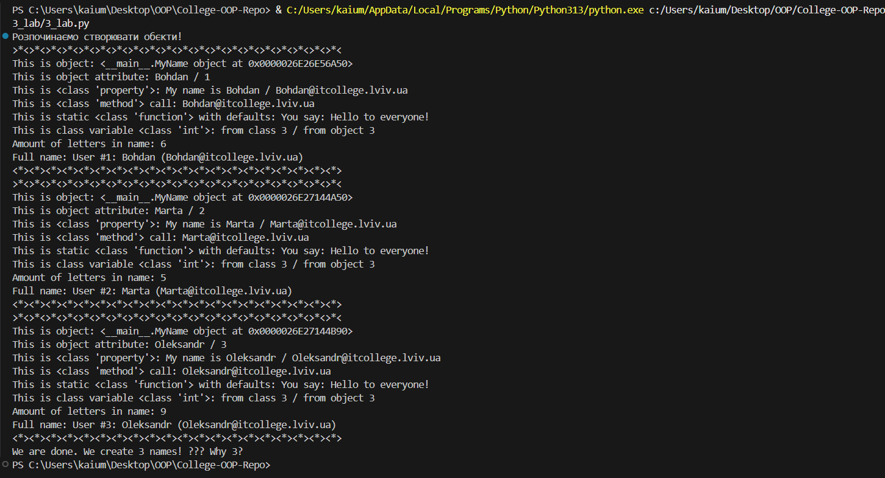

# Звіт до роботи
## Тема: _Знайомство з ООП_
### Мета роботи: _Навчитись використовувати основні принципи ООП, розглянути кострукції побудови класу та створення обєктів та навчитись працювати з ними_

---
### Виконання роботи
* Результати виконання завдання;
   1. Створіть два python файли: для Ноутбука з розширенням `.ipynb` та для скрипта з розширенням `.py`;
   2. Скопіюйте `Python` код наведений внизу у Ваш файл з розширенням `.py` та виконайте його натиснувши `Run Python File`;
   3. Виконайте приклади які розглядали на лекції та вставте їх у файл з розширенням `.ipynb`;
   4. Модифікуйте програму додавши своє імя в список;
   5. Дайте відповідь на запитання та зробіть індивідуальні завдання

### Код з виконаними завданнями:
```python
class MyName:
    """Опис класу / Документація
    """
    total_names = 0 #Class Variable

    def __init__(self, name=None) -> None:
        """Ініціалізація класу
        """
        if any(ch.isdigit() for ch in name):
            ValueError("Ім'я може містити лише літери!")
        self.name = name if name is not None else self.anonymous_user().name #Class attributes / Instance variables
        self.name = self.name.capitalize()
        MyName.total_names += 1 #modify class variable
        self.my_id = self.total_names

    @property
    def whoami(self) -> str: 
        """Class property
        return: повертаємо імя 
        """
        return f"My name is {self.name}"
    
    @property
    def my_email(self) -> str:
        """Class property
        return: повертаємо емейл
        """
        return self.create_email()
    
    @property
    def full_name(self) -> str:
        return f"User #{self.my_id}: {self.name} ({self.my_email})"
    
    
    def create_email(self, domain="itcollege.lviv.ua") -> str:
        """Instance method
        """
        return f"{self.name}@{domain}"
    
    def get_name_letters_count(self) -> int:
        return len(self.name)

    @classmethod
    def anonymous_user(cls):
        """Classs method
        """
        return cls("Anonymous")
    
    @staticmethod
    def say_hello(message="Hello to everyone!") -> str:
        """Static method
        """
        return f"You say: {message}"
    
    def save_to_file(self, filename="users.txt"):
        with open(filename, "a") as f:
            f.write(self.full_name + "\n")


print("Розпочинаємо створювати обєкти!")

names = ("Bohdan", "Marta", None, "oleksandr")
all_names = {name: MyName(name) for name in names if name is not None}

for name, me in all_names.items():
    print(f"""{">*<"*20}
This is object: {me} 
This is object attribute: {me.name} / {me.my_id}
This is {type(MyName.whoami)}: {me.whoami} / {me.my_email}
This is {type(me.create_email)} call: {me.create_email()}
This is static {type(MyName.say_hello)} with defaults: {me.say_hello()} 
This is class variable {type(MyName.total_names)}: from class {MyName.total_names} / from object {me.total_names}
Amount of letters in name: {me.get_name_letters_count()}
Full name: {me.full_name}
{"<*>"*20}""")

print(f"We are done. We create {me.total_names} names! ??? Why {MyName.total_names}?")
```

---
### Скріншоти з результатом виконання коду:


### Відповіді на запитання:
   1. Якщо в конструктор значення `None`, то спрацює метод `anonymous_user()`.
   2. Щоб змінити текст привітання потрібно передати у метод `say_hello()` параметр: `MyName.say_hello('Hello!')`
   3. Кількість літер у імені повертає метод `get_name_letters_count()`.
   4. Кількість імен у списку `names` та `total_names` різна, тому що `MyName.total_names` інкрементується при передачі парамтеру None у конструктор та при створенні анонімного користувача.
   5. Рядок `self.name = self.name.capitalize()` робить ім'я з великої літери.
   6. Додав параметр domain у метод `create_email()`, щоб була можливість змінити домен.
   7. Рядок `if any(ch.isdigit() for ch in name)` гарантує, що в імені не буде цифр.
   8. Додав властивість `full_name` повертає інформацію у форматі `"User #<id>: <name> (<email>)"`.
   9. Метод `save_to_file()` додає рядок з повною інформацією користувача у файл `users.txt`.

---
### Висновок:
- Ознайомився з основами ООП мови програмування `Python`.
- Попрактикувався у роботі з класами їх властивостями, методами та статичними методами.
---