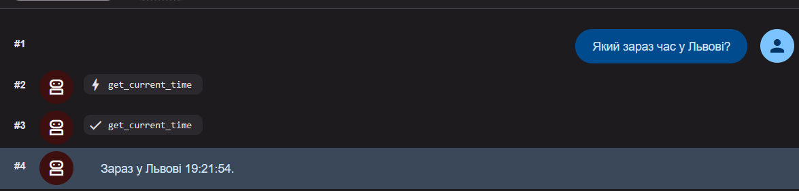
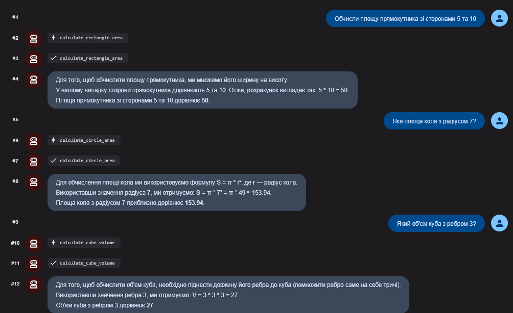
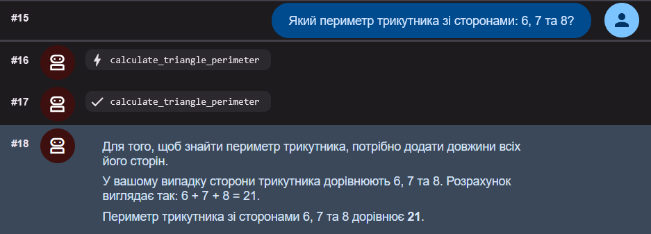
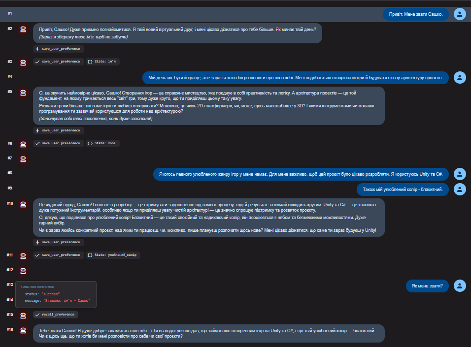
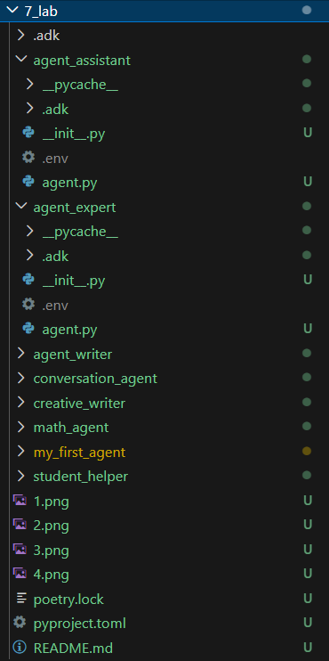

# Звіт до роботи
## Тема: _AI Агенти з Google ADK_
### Мета роботи: _Навчитись створювати AI агентів з використанням Google ADK (Python) та Poetry для управління залежностями проекту._

---
### Виконання роботи
   1. Python 3.13.9 та Poetry (version 2.3.3)
   2. poetry.lock файл створився. Він потрібен для точного вресіювання залежностей.
   3. adk, version 1.32.0
   4. ### Основні команди ADK
        api_server, conformance, create, deploy, eval, eval_set, migrate, optimize, run, web.
   5. ### Відповіді на питання:
      - Що таке `Agent` клас?
      Обгортка для ШІ-агента.
      - Для чого потрібен параметр `tools`?
      Для передачі інструментів і методів, що може використовувати агент.
      - Що робить функція `get_current_time`?
      Повертає поточний час у певному місті.
   6. ### Результат роботи з часовим агентом
        [user]: Який зараз час у Львові?\
        [time_agent]: Зараз у Львові 19:17:58.\
        [user]: Який зараз час у Києві?\
        [time_agent]: Зараз у Києві 19:18:06.\
        [user]: Який зараз час у Рівному?\
        [time_agent]: Зараз у Рівному 19:18:27.

   7. ### Результат роботи з агентом у Agent Development Kit
        

   8. ### Результат роботи з математичним агентом
        
   9. ### Результат виконання додаткового методу
        
   10. ### Результат роботи з агентом-помічником
        [user]: Поясни що таке декоратори в Python\
        [student_helper]: Привіт! Радий допомогти тобі розібратися з декораторами. Це одна з тих тем, яка на перший погляд здається «магією», але насправді в ній все дуже логічно.

        ### Що таке декоратор?

        Якщо пояснювати просто: **декоратор — це функція, яка бере іншу функцію, додає до неї якусь нову поведінку і повертає її назад.**

        Уяви, що функція — це подарунок. Декоратор — це обгортковий папір та стрічка. Сам подарунок залишається всередині, але тепер він виглядає інакше і його «використання» (розпакування) супроводжується додатковими діями.

        ---

        ### Як це виглядає в коді?

        У Python декоратори записуються через символ `@` перед назвою функції.

        авай створимо декоратор, який просто виводить повідомлення перед виконанням будь-якої функції:

        ```python
        def мій_декоратор(функція):
            def обгортка():
                print("--- Щось відбувається перед функцією ---")
                функція()
                print("--- Щось відбувається після функції ---")
            return обгортка

        @мій_декоратор
        def привітання():
            print("Привіт! Я звичайна функція.")

        # Викликаємо функцію
        привітання()
        ```

        **Що тут сталося?**
        Коли ми додали `@мій_декоратор` над `привітання()`, Python автоматично зробив таке:
        `привітання = мій_декоратор(привітання)`

        Тепер, коли ти викликаєш `привітання()`, насправді виконується внутрішня функція `обгортка`.

        ---

        ### Навіщо вони потрібні? (Best Practices)

        Декоратори ідеально підходять для завдань, які повторюються для багатьох функцій, щоб не дублювати код (принцип DRY — Don't Repeat Yourself):

        1.  **Логування:** Запис у файл того, що функція була викликана.
        2.  **Перевірка прав доступу:** Чи має користувач право виконувати цю дію?
        3.  **Вимірювання часу:** Скільки часу зайняло виконання функції (дуже корисно для оптимізації).
        4.  **Кешування:** Збереження результатів функції, щоб не рахувати одне й те саме двічі.

        ---

        ### Порада від викладача:
        Щоб декоратор працював універсально з функціями, які мають аргументи, використовуй `*args` та `**kwargs`. Ось як це виглядає:

        ```python
        def логер(func):
            def wrapper(*args, **kwargs):
                print(f"Викликаю функцію: {func.__name__}")
                return func(*args, **kwargs)
            return wrapper

        @логер
        def сума(a, b):
            return a + b

        print(сума(5, 10))
        ```

        **Чи хочеш ти, щоб я пояснив якийсь із цих моментів детальніше, чи, можливо, спробуємо написати свій декоратор для реальної задачі?**

        [user]: Як працює list comprehension?\
        [student_helper]: **List comprehension** (генератори списків) — це, мабуть, одна з найулюбленіших фішок Python серед програмістів. Вона дозволяє створювати нові списки на основі вже існуючих ітерабельних об'єктів (списків, діапазонів, рядків тощо) всього в один рядок коду.

        Це замінює довгі цикли `for` і робить код набагато чистішим та зрозумілішим.

        ### Як це виглядає?

        Уяви, що тобі потрібно створити список квадратів чисел від 0 до 4.

        **Звичайний підхід (через цикл `for`):**
        ```python
        результат = []
        for i in range(5):
            результат.append(i * i)
        # Результат: [0, 1, 4, 9, 16]
        ```

        **Підхід з List Comprehension:**
        ```python
        результат = [i * i for i in range(5)]
        # Результат: [0, 1, 4, 9, 16]
        ```

        ---

        ### Синтаксис

        Конструкція виглядає так:
        `[вираз for елемент in ітерабельний_об'єкт if умова]`

        1.  **вираз**: те, що ти хочеш покласти в новий список (наприклад, `i * i`).
        2.  **for елемент in ітерабельний_об'єкт**: стандартний цикл.
        3.  **if умова** (необов'язково): фільтрація елементів.

        ---

        ### Приклад з умовою (фільтрація)

        Якщо ти хочеш отримати лише квадрати парних чисел:

        ```python
        квадрати_парних = [i * i for i in range(10) if i % 2 == 0]
        # Результат: [0, 4, 16, 36, 64]
        ```

        ---

        ### Чому це вважається Best Practice?

        *   **Компактність:** Менше рядків коду — менше місць, де можна зробити помилку.
        *   **Швидкість:** List comprehension працює трохи швидше за звичайний `for` з `append`, оскільки він оптимізований всередині самого інтерпретатора Python.
        *   **Читабельність:** Після того, як ти звикнеш до синтаксису, читати такий код набагато легше, ніж перебирати очима кілька рядків циклу.

        ### Порада від викладача:
        Не намагайся «запхати» занадто складну логіку в один рядок. Якщо твій вираз у `list comprehension` стає занадто довгим (наприклад, з багатьма вкладеними умовами), краще розбий його на звичайний цикл. **Код має бути не тільки коротким, а й зрозумілим для інших (і для тебе через тиждень!).**

        Хочеш спробувати самостійно написати list comprehension? Наприклад, як би ти перетворив список рядків `["привіт", "світ", "python"]` у список, де кожен рядок написаний великими літерами (верхній регістр)?

        [user]: Перевір синтаксис: print('Hello World')
        [student_helper]: Чудово, твій код абсолютно правильний!

        Синтаксис:
        ```python
        print('Hello World')
        ```
        Цей рядок успішно пройде перевірку. Бачу, що ти чудово розпочинаєш роботу з Python. Чи є у тебе ще якісь питання або, можливо, хочеш розібрати щось складніше?

11. ### Результат агента-експерта

    [user]: Створи найсумнішу й найкоротшу повість\
    [agent_expert]: Ось найкоротша і найсумніша історія, яку я можу вам розповісти:

    **«Продаються дитячі черевички. Неношені».**

    *(Цей текст, який часто приписують Ернесту Гемінґвею, є класичним прикладом того, як усього шість слів можуть розбити серце, залишаючи читачеві простір для найтрагічнішої уяви).*

    ### Результат агента-асистента

    [user]: Створи найсумнішу й найкоротшу повість\
    [agent_assistant]: Ось найкоротша і найсумніша повість, яку я можу вам розповісти:

    ***

    **Дитячі черевички**

    Він купив їх, коли ще не знав, що станеться. Маленькі, шкіряні, з м’якою підошвою, вони чекали свого часу в коробці на верхній полиці шафи.

    Сьогодні він дістав їх знову. Поставив на підлогу, де ніколи не пролунає тупіт крихітних ніжок. Потім тихо зачинив двері, назавжди залишаючи в кімнаті порожнечу, яку неможливо заповнити.

    *Продаються: дитячі черевички. Неношені.*

    ### Результат агента-письменника

    [user]: Створи найсумнішу й найкоротшу повість\
    [agent_writer]: Ось найкоротша і найсумніша історія, яка коли-небудь була написана (класичний прийом, приписуваний Гемінґвею, але адаптований у дусі вашого запиту):

    ***

    **Продаються дитячі черевички. Неношені.**

12. ### Результат роботи з агентом із пам'яттю
    

13. ### Струкртура проєкту з агентами
    

14. Я створив агента Game Idea Generator, який генерує ідеї для комп’ютерних і мобільних ігор. Агент отримує від користувача жанр, платформу, кількість гравців або тип гри, після чого формує структуровану ідею.
    
    Я обрав саме такі інструкції, тому що агент має відповідати не просто випадковим текстом, а у зрозумілому форматі: назва гри, жанр, платформа, опис, механіка, мета та унікальна особливість. Це робить відповідь зручною для читання і подальшого використання в навчальному або практичному проєкті.

    Я додав три інструменти:

    `generate_game_idea`

    Цей інструмент створює базову ідею гри. Він перевіряє, чи користувач ввів жанр, платформу та коректну кількість гравців. Якщо дані правильні, функція повертає структурований результат у форматі dict.

    `generate_game_mechanic`

    Цей інструмент генерує окрему ігрову механіку для певного типу гри, наприклад survival, puzzle, rpg або strategy. Він корисний, коли користувачу потрібна не повна ідея гри, а лише основна механіка.

    `estimate_game_scope`

    Цей інструмент оцінює масштаб майбутньої гри залежно від кількості людей у команді, часу розробки та складності. Він демонструє валідацію числових даних і допомагає зрозуміти, наскільки реалістичним є проєкт.

    Цей агент відповідає порадам щодо створення ефективних агентів, тому що має чіткі інструкції, якісні інструменти, обробку помилок, валідацію вводу та структуровані результати.
```python
from random import choice
from google.adk.agents.llm_agent import Agent
from google.genai.types import GenerateContentConfig


def generate_game_idea(genre: str, platform: str = "PC", players: int = 1) -> dict:
    """
    Генерує базову ідею для гри за жанром, платформою та кількістю гравців.

    Args:
        genre: жанр гри, наприклад RPG, Puzzle, Horror, Strategy, Adventure
        platform: платформа гри, наприклад PC, Mobile, Console
        players: кількість гравців

    Returns:
        dict: структурована ідея гри або повідомлення про помилку
    """

    if not genre or genre.strip() == "":
        return {
            "status": "error",
            "error": "Жанр гри не може бути порожнім",
            "result": None
        }

    if not platform or platform.strip() == "":
        return {
            "status": "error",
            "error": "Платформа гри не може бути порожньою",
            "result": None
        }

    if players < 1:
        return {
            "status": "error",
            "error": "Кількість гравців має бути більшою або дорівнювати 1",
            "result": None
        }

    genre = genre.strip().lower()
    platform = platform.strip()

    settings = [
        "покинуте космічне місто",
        "магічний ліс, який змінюється щоночі",
        "підводна цивілізація",
        "кіберпанковий мегаполіс",
        "середньовічне королівство після катастрофи",
        "школа для винахідників",
        "планета, де час рухається назад"
    ]

    mechanics = [
        "гравець відкриває нові здібності через дослідження світу",
        "кожне рішення змінює сюжет і поведінку персонажів",
        "ігровий світ перебудовується після кожного рівня",
        "ресурси обмежені, тому потрібно планувати кожен крок",
        "персонаж має унікальну силу, але вона має небезпечні наслідки",
        "гравець комбінує предмети для створення нових можливостей"
    ]

    goals = [
        "врятувати світ від поступового зникнення",
        "знайти джерело дивної енергії",
        "розкрити таємницю головного героя",
        "побудувати безпечне поселення",
        "перемогти систему, яка контролює життя людей",
        "повернути втрачені спогади"
    ]

    unique_features = [
        "сюжет змінюється залежно від стилю гри користувача",
        "вороги навчаються на діях гравця",
        "кожен рівень генерується випадково",
        "гравець може змінювати правила світу",
        "персонажі пам’ятають попередні дії гравця",
        "фінал залежить не від перемог, а від моральних рішень"
    ]

    title_words = [
        "Echo", "Shadow", "Nova", "Chrono", "Crystal", "Last", "Hidden", "Broken"
    ]

    title_objects = [
        "Realm", "Signal", "Forest", "Protocol", "Kingdom", "Memory", "Island", "Machine"
    ]

    title = f"{choice(title_words)} {choice(title_objects)}"

    idea = {
        "title": title,
        "genre": genre,
        "platform": platform,
        "players": players,
        "setting": choice(settings),
        "main_mechanic": choice(mechanics),
        "goal": choice(goals),
        "unique_feature": choice(unique_features)
    }

    return {
        "status": "success",
        "error": None,
        "result": idea
    }


def generate_game_mechanic(game_type: str) -> dict:
    """
    Генерує ігрову механіку для заданого типу гри.

    Args:
        game_type: тип гри, наприклад survival, puzzle, rpg, strategy

    Returns:
        dict: опис ігрової механіки або повідомлення про помилку
    """

    if not game_type or game_type.strip() == "":
        return {
            "status": "error",
            "error": "Тип гри не може бути порожнім",
            "mechanic": None
        }

    game_type = game_type.strip().lower()

    mechanics_by_type = {
        "survival": [
            "гравець має контролювати голод, енергію та температуру",
            "ресурси поступово зникають, тому потрібно досліджувати нові території",
            "кожна ніч стає небезпечнішою за попередню"
        ],
        "puzzle": [
            "гравець змінює напрямок гравітації для проходження рівнів",
            "кожна дія відкриває одну можливість, але блокує іншу",
            "головоломки будуються навколо керування часом"
        ],
        "rpg": [
            "навички персонажа розвиваються залежно від дій, а не від рівнів",
            "репутація змінює ставлення NPC до гравця",
            "предмети мають історію та можуть впливати на сюжет"
        ],
        "strategy": [
            "гравець керує містом з обмеженими ресурсами",
            "вороги адаптують тактику після кожної битви",
            "успіх залежить від дипломатії, економіки та оборони"
        ]
    }

    selected_mechanics = mechanics_by_type.get(
        game_type,
        [
            "гравець поступово відкриває нові правила світу",
            "ігрові рішення мають довготривалі наслідки",
            "основна механіка поєднує дослідження, ризик і винагороду"
        ]
    )

    return {
        "status": "success",
        "game_type": game_type,
        "mechanic": choice(selected_mechanics)
    }


def estimate_game_scope(team_size: int, development_months: int, complexity: str) -> dict:
    """
    Оцінює приблизний масштаб гри за розміром команди, часом розробки та складністю.

    Args:
        team_size: кількість людей у команді
        development_months: кількість місяців на розробку
        complexity: складність гри: low, medium або high

    Returns:
        dict: рекомендація щодо масштабу гри або повідомлення про помилку
    """

    if team_size < 1:
        return {
            "status": "error",
            "error": "Команда має містити хоча б одну людину",
            "recommendation": None
        }

    if development_months < 1:
        return {
            "status": "error",
            "error": "Кількість місяців має бути більшою або дорівнювати 1",
            "recommendation": None
        }

    complexity = complexity.strip().lower()

    if complexity not in ["low", "medium", "high"]:
        return {
            "status": "error",
            "error": "Складність має бути: low, medium або high",
            "recommendation": None
        }

    score = team_size * development_months

    if complexity == "high":
        score -= 6
    elif complexity == "medium":
        score -= 3

    if score <= 3:
        recommendation = "Дуже маленька гра: один рівень, одна основна механіка, мінімум графіки."
    elif score <= 8:
        recommendation = "Невелика інді-гра: кілька рівнів, проста система прогресу, базовий сюжет."
    elif score <= 15:
        recommendation = "Середній проєкт: декілька механік, персонажі, меню, збереження прогресу."
    else:
        recommendation = "Більший проєкт: можна додати сюжетну кампанію, різні режими та складніші системи."

    return {
        "status": "success",
        "team_size": team_size,
        "development_months": development_months,
        "complexity": complexity,
        "recommendation": recommendation
    }


root_agent = Agent(
    model="gemini-3.1-flash-lite-preview",
    name="game_idea_generator",
    description="Агент для генерації ідей комп’ютерних та мобільних ігор.",
    instruction="""
    Ти агент-генератор ідей для ігор.

    Твоє завдання:
    - допомагати створювати концепції нових ігор;
    - пропонувати жанр, сетинг, основну механіку, ціль гри та унікальну особливість;
    - відповідати українською мовою;
    - давати структуровану відповідь;
    - не писати занадто довго, якщо користувач не просить детальний опис.

    Формат відповіді для ідеї гри:
    1. Назва гри
    2. Жанр
    3. Платформа
    4. Короткий опис
    5. Основна механіка
    6. Мета гравця
    7. Унікальна особливість

    Використовуй інструмент generate_game_idea, коли користувач просить придумати ідею гри.
    Використовуй інструмент generate_game_mechanic, коли користувач просить придумати окрему механіку.
    Використовуй інструмент estimate_game_scope, коли користувач питає, наскільки складною може бути гра для певної команди або терміну.
    Якщо користувач дає некоректні дані, поясни помилку простими словами.
    """,
    tools=[
        generate_game_idea,
        generate_game_mechanic,
        estimate_game_scope
    ],
    generate_content_config=GenerateContentConfig(
        temperature=1.2,
        top_k=40,
        top_p=0.95,
    )
)
```
---
### Висновок:
- Навчився створювати AI агентів з використанням Google ADK (Python) та Poetry для управління залежностями проекту
---